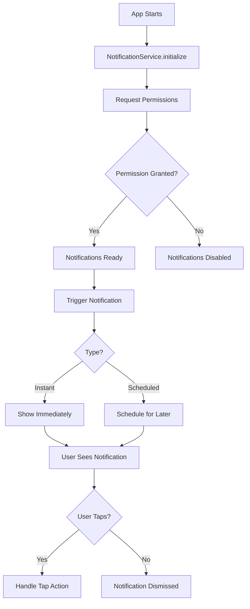

# Flutter Local Notifications - Implementation Guide

## Overview

This project implements **Flutter Local Notifications** to provide users with timely reminders and updates about their tasks. The notification system is built using the `flutter_local_notifications` package and is fully integrated with the todo app's architecture.

---

## 📋 Table of Contents

- [What Was Implemented](#what-was-implemented)
- [How Notifications Work](#how-notifications-work)
- [When Notifications Are Sent](#when-notifications-are-sent)
- [Project Structure](#project-structure)
- [Android Configuration](#android-configuration)
- [Usage Examples](#usage-examples)
- [Backup & Restoration](#backup--restoration)

---

## What Was Implemented

### 1. **Dependencies Added**

Added `flutter_local_notifications: ^18.0.1` to `pubspec.yaml` to enable local notification functionality.

### 2. **Android Configuration**

Modified `android/app/src/main/AndroidManifest.xml` to include required permissions:

```xml
<!-- Notification permissions -->
<uses-permission android:name="android.permission.POST_NOTIFICATIONS"/>
<uses-permission android:name="android.permission.RECEIVE_BOOT_COMPLETED"/>
<uses-permission android:name="android.permission.VIBRATE"/>
<uses-permission android:name="android.permission.SCHEDULE_EXACT_ALARM"/>
```

**What these permissions do**:
- `POST_NOTIFICATIONS` - Required for Android 13+ to display notifications
- `RECEIVE_BOOT_COMPLETED` - Keeps scheduled notifications active after device restart
- `VIBRATE` - Enables notification vibration
- `SCHEDULE_EXACT_ALARM` - Allows precise timing for scheduled notifications

### 3. **Notification Service**

Created `lib/app/utils/notification_service.dart` - A singleton service that handles all notification operations:

**Features**:
- ✅ Automatic permission requests (Android 13+ and iOS)
- ✅ Instant notifications
- ✅ Scheduled notifications
- ✅ Task-specific notification methods
- ✅ Notification management (cancel, cancel all, get pending)
- ✅ Error handling and logging

### 4. **App Initialization**

Integrated notification service initialization in `lib/main.dart`:

```dart
// Initialize local notifications
await NotificationService().initialize();
```

The service is initialized at app startup, right after Firebase Analytics initialization.

### 5. **Backup System**

All modified Android files were backed up to `android_backups/` folder before changes:
- `android_backups/app/src/main/AndroidManifest.xml`
- `android_backups/app/build.gradle.kts`
- `android_backups/README.md` (restoration guide)

---

## How Notifications Work

### Notification Flow



### Notification States Handled
The app handles notifications in all three states:

1.  **Foreground**: Notification appears as a heads-up alert (or handled silently). Tapping triggers `_onNotificationTapped`.
2.  **Background**: Notification appears in system tray. Tapping brings app to foreground and triggers `_onNotificationTapped`.
3.  **Terminated**: Notification appears in system tray. Tapping launches the app, and `getNotificationAppLaunchDetails()` detects the launch to trigger `_onNotificationTapped`.

### Timezone Support
The app uses the `timezone` package to ensure scheduled notifications respect local timezones, preventing issues with daylight saving time or travel.

### Notification Channels

The app uses two notification channels:

| Channel ID | Channel Name | Description | Priority |
|------------|--------------|-------------|----------|
| `default_channel` | Default Notifications | For instant notifications | High |
| `scheduled_channel` | Scheduled Notifications | For scheduled reminders | High |

---

## When Notifications Are Sent

### Current Implementation

The notification service is **ready to use** but notifications are **not automatically triggered yet**. You need to integrate the notification calls into your task management logic.

### Recommended Notification Triggers

Here's when you should send notifications in your todo app:

#### 1. **Task Created** (Optional)
Send a confirmation notification when a new task is created.

```dart
// When user creates a task
await NotificationService().showNotification(
  id: task.id,
#### 4. **Daily Summary** (Optional)
Send a daily notification with pending tasks count.

```dart
// Schedule daily at 9:00 AM
await NotificationService().scheduleNotification(
  id: 999, // Unique ID for daily summary
  title: 'Daily Task Summary',
  body: 'You have $pendingCount pending tasks today',
  scheduledDate: DateTime(now.year, now.month, now.day, 9, 0),
);
```

#### 5. **Overdue Task Alert** (Optional)
Send notifications for overdue tasks.

```dart
// Check for overdue tasks and notify
if (task.dueDate != null && task.dueDate!.isBefore(DateTime.now())) {
  await NotificationService().showNotification(
    id: task.id,
    title: '⚠️ Overdue Task',
    body: task.title,
    payload: 'task_${task.id}',
  );
}
```

---

## Project Structure

### Notification-Related Files

```
todo_app/
├── lib/
│   ├── app/
│   │   └── utils/
│   │       └── notification_service.dart    # Main notification service
│   └── main.dart                            # Service initialization
├── android/
│   └── app/
│       └── src/
│           └── main/
│               └── AndroidManifest.xml      # Android permissions
├── android_backups/                         # Backup folder
│   ├── README.md                            # Restoration guide
│   └── app/
│       ├── build.gradle.kts                 # Backup
│       └── src/
│           └── main/
│               └── AndroidManifest.xml      # Backup
└── pubspec.yaml                             # Dependencies
```

---

## Android Configuration

### Permissions Explained

| Permission | Required For | Android Version |
|------------|--------------|-----------------|
| `POST_NOTIFICATIONS` | Showing notifications | Android 13+ (API 33+) |
| `RECEIVE_BOOT_COMPLETED` | Persisting scheduled notifications after reboot | All versions |
| `VIBRATE` | Vibrating on notification | All versions |
| `SCHEDULE_EXACT_ALARM` | Precise timing for scheduled notifications | Android 12+ (API 31+) |

### Runtime Permission Request

For Android 13+ devices, the app automatically requests notification permission on first launch:

```dart
// Handled automatically in NotificationService.initialize()
await androidImplementation.requestNotificationsPermission();
```

---

## Usage Examples

### Example 1: Show Instant Notification

```dart
await NotificationService().showNotification(
  id: 1,
  title: 'Hello!',
  body: 'This is a test notification',
  payload: 'test_payload', // Optional data
);
```

### Example 2: Schedule Notification

```dart
// Schedule for tomorrow at 10:00 AM
final tomorrow = DateTime.now().add(Duration(days: 1));
final scheduledTime = DateTime(
  tomorrow.year,
  tomorrow.month,
  tomorrow.day,
  10, // hour
  0,  // minute
);

await NotificationService().scheduleNotification(
  id: 2,
  title: 'Scheduled Reminder',
  body: 'This notification was scheduled!',
  scheduledDate: scheduledTime,
);
```

### Example 3: Task Reminder

```dart
await NotificationService().showTaskReminder(
  taskId: task.id,
  taskTitle: task.title,
  taskDescription: task.description,
);
```

### Example 4: Cancel Notification

```dart
// Cancel a specific notification
await NotificationService().cancelNotification(taskId);

// Or cancel all notifications
await NotificationService().cancelAllNotifications();
```

### Example 5: Get Pending Notifications

```dart
final pending = await NotificationService().getPendingNotifications();
print('Pending notifications: ${pending.length}');
```

---

## Available Methods

### NotificationService Methods

| Method | Description | Parameters |
|--------|-------------|------------|
| `initialize()` | Initialize notification service | None |
| `showNotification()` | Show instant notification | `id`, `title`, `body`, `payload?` |
| `scheduleNotification()` | Schedule notification for later | `id`, `title`, `body`, `scheduledDate`, `payload?` |
| `cancelNotification()` | Cancel specific notification | `id` |
| `cancelAllNotifications()` | Cancel all notifications | None |
| `getPendingNotifications()` | Get list of pending notifications | None |
| `showTaskReminder()` | Show task reminder | `taskId`, `taskTitle`, `taskDescription?` |
| `scheduleTaskReminder()` | Schedule task reminder | `taskId`, `taskTitle`, `reminderTime`, `taskDescription?` |
| `showTaskCompletionNotification()` | Show task completion celebration | `taskTitle` |

---

## Backup & Restoration

### Backup Location

All original Android configuration files are backed up at:

```
android_backups/
├── README.md (detailed restoration guide)
└── app/
    ├── build.gradle.kts
    └── src/
        └── main/
            └── AndroidManifest.xml
```

### How to Restore

If you need to remove the notification functionality and restore original files:

1. **Navigate to project root**:
   ```powershell
   cd d:\Users\Sarang\Documents\Flutter_Projects\todo_app
   ```

2. **Restore AndroidManifest.xml**:
   ```powershell
   Copy-Item "android_backups\app\src\main\AndroidManifest.xml" -Destination "android\app\src\main\AndroidManifest.xml" -Force
   ```

3. **Clean and rebuild**:
   ```powershell
   flutter clean
   flutter pub get
   flutter run
   ```

For detailed restoration instructions, see: [`android_backups/README.md`](android_backups/README.md)

---

## Testing Notifications

### Manual Testing Steps

1. **Run the app**:
   ```powershell
   flutter run
   ```

2. **Grant notification permission** (Android 13+):
   - The app will request permission on first launch
   - Tap "Allow" when prompted

3. **Test instant notification**:
   ```dart
   // Add this temporarily in your code
   await NotificationService().showNotification(
     id: 1,
     title: 'Test',
     body: 'Testing notifications!',
   );
   ```

4. **Verify notification appears** in the notification tray

5. **Tap the notification** to test interaction

---

## Next Steps

To fully integrate notifications into your todo app:

1. ✅ **Task Creation**: Add notification when task is created
2. ✅ **Task Reminder**: Schedule notification for task due dates
3. ✅ **Task Completion**: Show celebration notification
4. ⚠️ **Handle Notification Taps**: Implement navigation in `_onNotificationTapped()` method
5. ⚠️ **Daily Summary**: Add scheduled daily notifications
6. ⚠️ **Overdue Alerts**: Notify users about overdue tasks

---

## Troubleshooting

### Notifications Not Showing?

1. **Check permissions**: Ensure notification permission is granted in device settings
2. **Check Android version**: For Android 13+, runtime permission is required
3. **Check logs**: Look for errors in the console using Logger
4. **Rebuild app**: Try `flutter clean && flutter pub get && flutter run`

### Scheduled Notifications Not Working?

1. **Check SCHEDULE_EXACT_ALARM permission**: Required for Android 12+
2. **Test on physical device**: Scheduled notifications may not work reliably on emulators
3. **Check battery optimization**: Some devices kill background tasks

### Build Error: "Requires core library desugaring"?

If you get this error:
```
Dependency ':flutter_local_notifications' requires core library desugaring to be enabled
```

**Solution**: This has already been fixed in `android/app/build.gradle.kts`:
- Enabled `coreLibraryDesugaringEnabled = true`
- Added `coreLibraryDesugaring` dependency

If the error persists:
1. Run `flutter clean`
2. Run `flutter pub get`
3. Rebuild the app

---

## Resources

- [flutter_local_notifications package](https://pub.dev/packages/flutter_local_notifications)
- [Android notification permissions](https://developer.android.com/develop/ui/views/notifications/notification-permission)
- [Flutter notification best practices](https://docs.flutter.dev/platform-integration/android/platform-views)

---

## Summary

✅ **Implemented**: Complete local notification system  
✅ **Configured**: Android permissions and settings  
✅ **Created**: Notification service with task-specific methods  
✅ **Backed up**: All Android configuration files  
✅ **Initialized**: Service runs at app startup  
⚠️ **Pending**: Integration with task creation/completion logic  

The notification infrastructure is ready to use. You just need to call the appropriate notification methods when tasks are created, completed, or when reminders should be scheduled!
